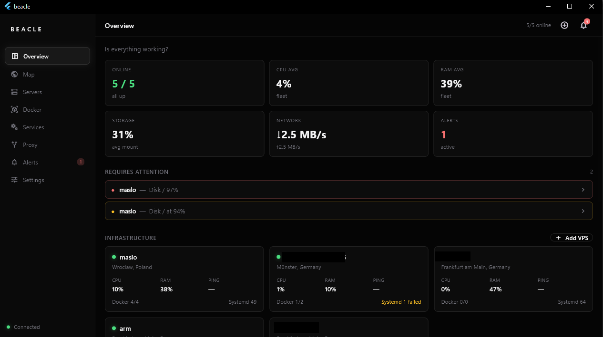
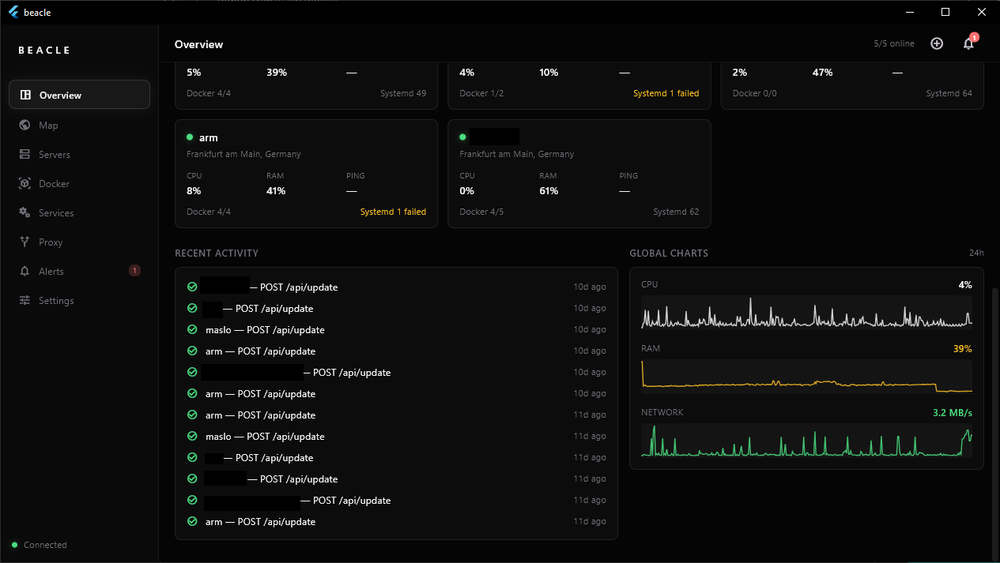
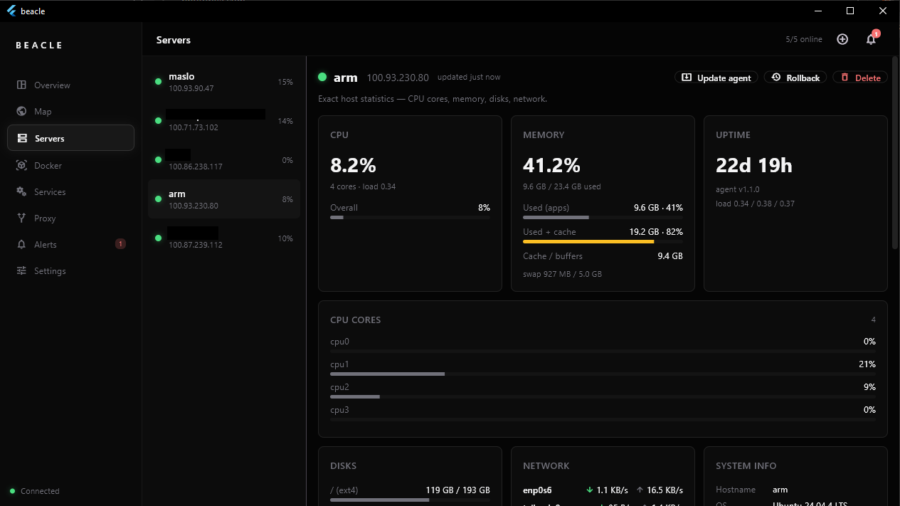
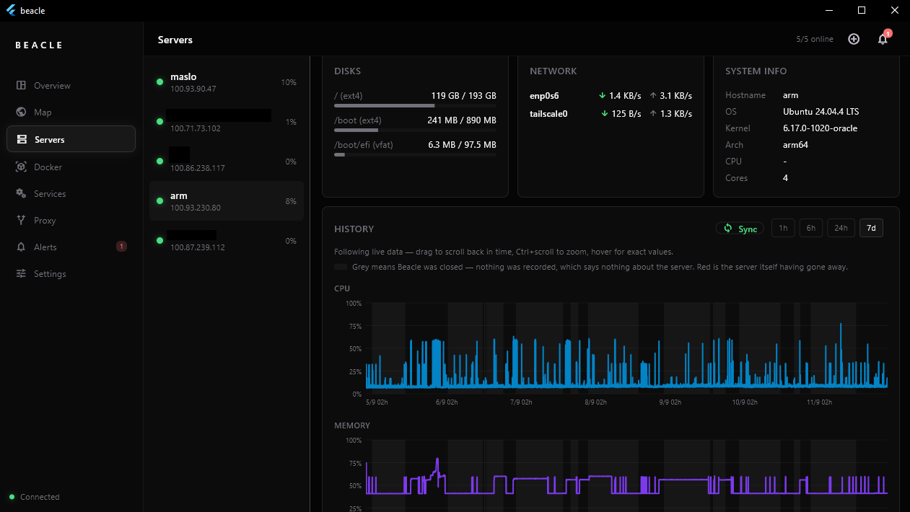
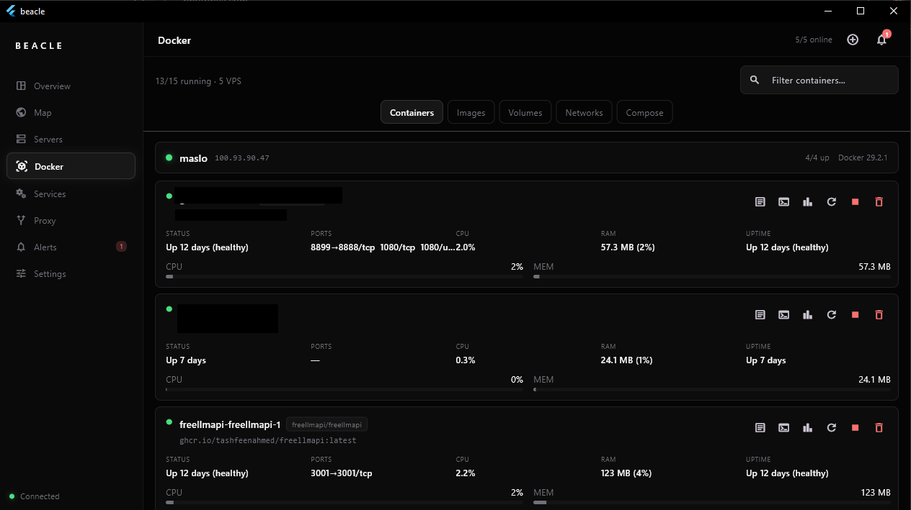
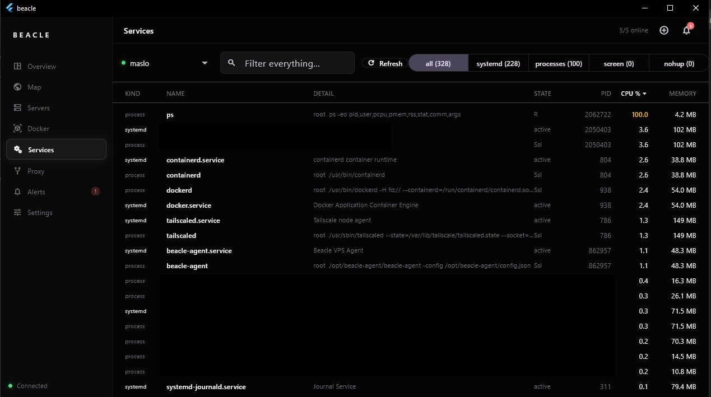
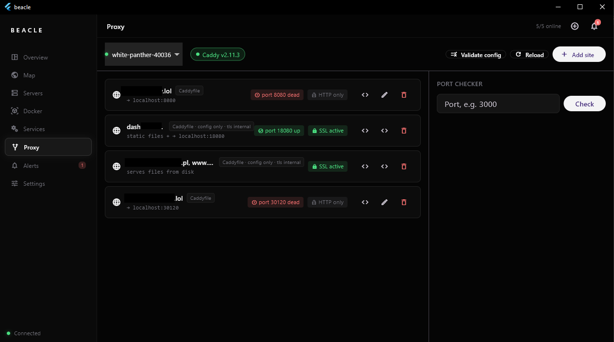
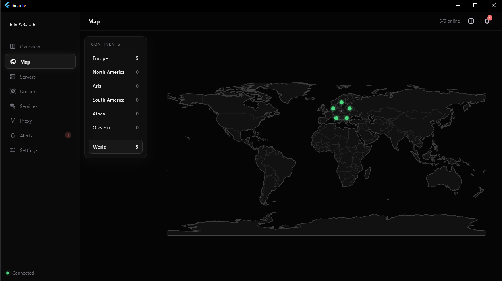
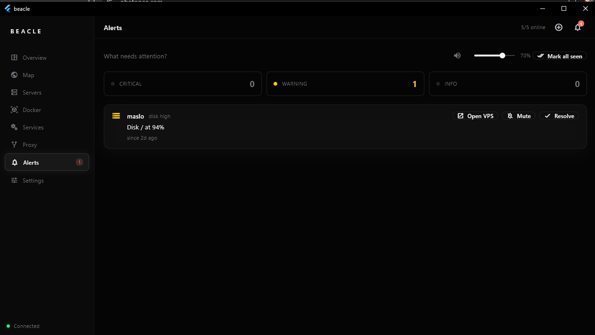
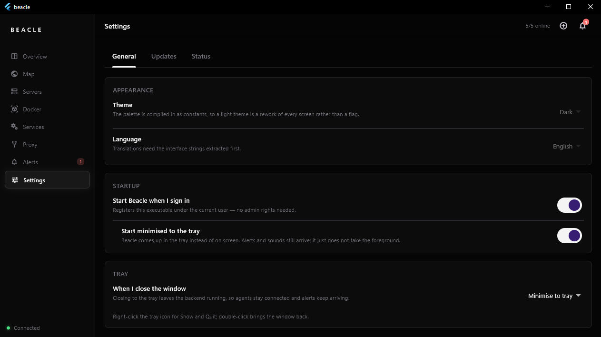

<h1 align="center">Beacle</h1>
<p align="center">
  
  
  
  
  
  
  
</p>

<p align="center">
  <a href="https://github.com/c-airr/beacle/actions/workflows/release.yml"></a>
  
  
  
  
</p>

<p align="center">
  
  
  
  
  
  
</p>

<p align="center">
  
  
</p>

A desktop panel for managing your VPS fleet, so you don't have to juggle SSH sessions across ten terminals anymore. Monitoring, Docker, systemd, reverse proxy, and a map of your infrastructure — all in one app.

**Status: stable** — 1.1.0 is out, with builds for Windows, Linux and macOS.

---

## Screenshots

### Overview — is everything working?

Fleet totals up top, anything that needs attention right below, then a card per VPS.



Scroll down for recent agent activity and 24h fleet-wide CPU / RAM / network charts.



### Servers — exact host statistics

CPU per core, memory split into apps vs cache, disks, network interfaces, uptime and system info.



History goes back 7 days. Grey means Beacle was closed and nothing was recorded — red is the server itself having gone away. Drag to scroll back in time, Ctrl+scroll to zoom, click a spike to see what was running.



### Docker

Every container across the fleet in one list — logs, exec, stats, restart, stop, remove. Images, volumes, networks and compose are one tab away.



### Services

systemd units, processes, screen and nohup sessions side by side, sortable by CPU or memory.



### Proxy

Caddy sites with their upstreams and TLS state, edited from the GUI instead of by hand. The port checker tells you whether anything is actually listening.



### Map

Where your servers physically are, grouped by continent.



### Alerts

Thresholds breached, with hysteresis so a flapping disk doesn't spam you. Mute, resolve, or jump straight to the VPS.



### Settings

Theme, language, startup and tray behaviour — plus agent updates and backend status on the other tabs.



---

## What it actually does

Beacle is three components talking to each other over Tailscale:

- **Flutter app (Windows / Linux / macOS)** — the panel you run on your PC
- **Go backend** — runs locally alongside the app (embedded in `beacle.exe`), talks to agents over WebSocket
- **Go agent** — sits on each of your VPS instances (Linux, amd64 or arm64), collects metrics, manages Docker/systemd/proxy

All traffic goes over Tailscale, outbound-only, so you don't need to open any ports or worry about CGNAT. The agent connects to the backend, not the other way around.

### What's in the panel

- **Overview** — the whole fleet at a glance, plus whatever needs attention
- **Servers** — CPU per core, memory, disks, network per VPS, live, with 7 days of recorded history you can scroll back through
- **Docker** — containers, images, volumes, networks, compose; logs and exec included
- **Services** — systemd units, processes, screen and nohup sessions in one sortable list
- **Proxy** — GUI for Caddy or Nginx Proxy Manager, no manual config editing, with a port checker
- **Map** — where your servers physically are
- **Alerts** — thresholds breached (CPU, RAM, disk, server offline), with hysteresis so it doesn't spam every 5 seconds
- **Settings** — startup and tray behaviour, agent updates, backend status

---

## Getting it running

You'll need Tailscale installed on your PC and on every VPS you want to connect. Beacle doesn't manage the VPN itself, it just rides on top of it.

1. Grab your platform's build from the [latest GitHub Release](https://github.com/c-airr/beacle/releases/latest) — every binary there is **built by GitHub Actions from this repo**, never uploaded by hand (check the green Actions badge and `gh attestation verify`)

   | Platform | File |
   |---|---|
   | Windows | `beacle-setup-*.exe` (installer) or `beacle-windows-x64.zip` (portable) |
   | Linux | `beacle-linux-x64.tar.gz` |
   | macOS | `beacle-macos.zip` — unsigned, so first launch needs a right-click → Open |

2. On first launch you'll go through a short setup wizard
3. Add your VPS instances from the Tailscale device list
4. On each VPS, run the one-liner the panel gives you

That's it — the agent registers itself and the panel starts getting data. Agents are Linux only, amd64 or arm64, picked automatically by the installer.

### Verify a download (optional)

```bash
# Checksums shipped with every release
sha256sum -c SHA256SUMS.txt

# Prove the file was built by this repository's Release workflow
gh attestation verify ./beacle-setup-1.1.0.exe --repo c-airr/beacle
```

### Cut a release (maintainers)

```bash
git tag 1.2.0
git push origin 1.2.0
# or: Actions → Release → Run workflow → tag 1.2.0
```

Do **not** upload app or agent binaries by hand. The workflow builds them on `windows-latest`, `ubuntu-latest` and `macos-latest`, attaches SLSA provenance attestations, and publishes the GitHub Release.

---

## Roadmap

### Shipped

- [x] Single WebSocket tunnel agent ↔ backend (register, snapshots, commands, power modes)
- [x] Backend embedded in the app's lifecycle
- [x] Tailscale `serve` + Windows firewall helpers
- [x] Agent deploy and updates straight from GitHub Releases, per architecture
- [x] The full UI — Overview, Servers, Docker, Services, Proxy, Map, Alerts, Settings
- [x] Onboarding and a VPS install one-liner
- [x] Adaptive refresh (active / eco / sleep) without dropping the WebSocket
- [x] Recorded history with pannable charts; agents buffer samples while the panel is away
- [x] Windows installer, Linux tarball, macOS bundle — all built and attested by CI

### Next

- [ ] Light theme — the palette is compiled in as constants, so it is a rework of every screen
- [ ] Translations — the interface strings need extracting first
- [ ] Signed and notarised macOS builds (right-click → Open until then)

### v2.0 — platform

- **Plugin system** — extend Beacle with custom panels and data frames without forking core
- **Architecture refresh** — cleaner separation for long-term maintenance
- **No Tailscale requirement** — direct or tunneled connectivity options
- UI refresh and improved navigation
- Performance and UX improvements across the board

---

## Stack

Dart (Flutter) · Go · WebSocket · Tailscale

## License

MIT
